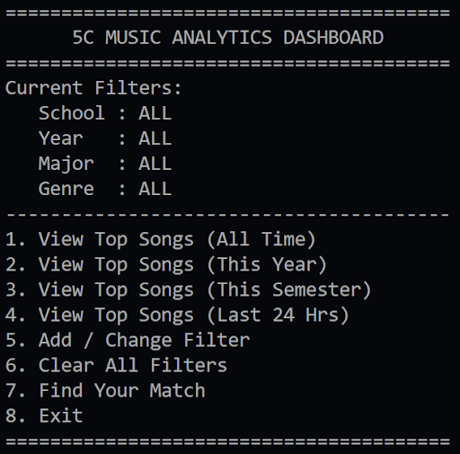
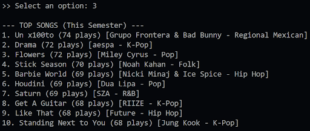
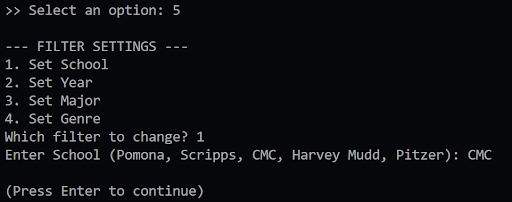
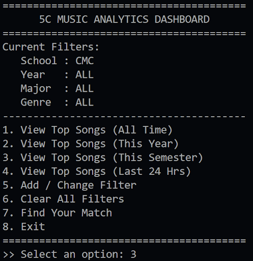
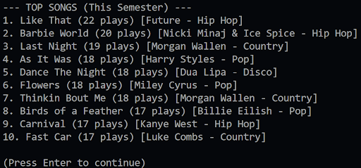
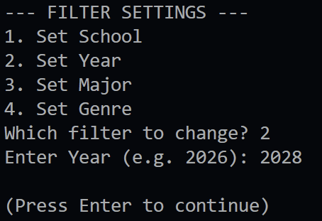
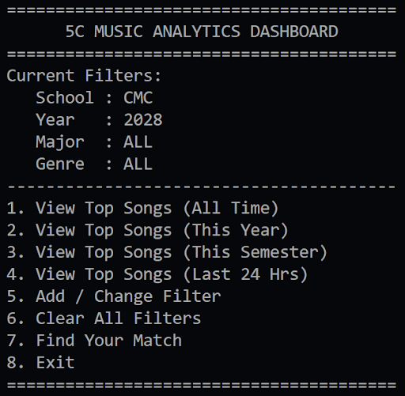
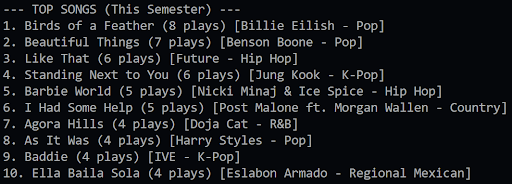
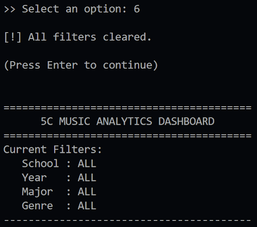
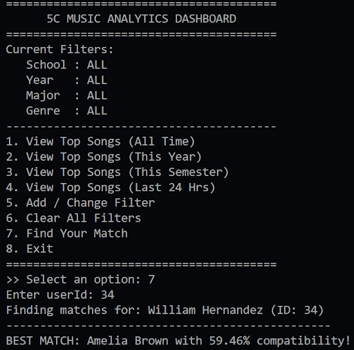

# 5CAux

5CAux is a Java-based music analytics application for students at the Claremont Colleges that analyzes collective listening data to illustrate campus-wide music trends and help users discover peers with similar musical tastes. The program runs as an interactive command-line application backed by CSV datasets.

## Example Output

### Sort by Number of Plays
<div>
  
  
</div>

---

### Filter by Date
<div>
  
</div>

---

### Filter by One Category (e.g. School, Year, Major, Genre)
<div>
  
  
  
</div>

---

### Combining Filters
<div>
  
  
  
</div>

---

### Clearing Filters
<div>
  
</div>

---

### Matching Users Based on Music Taste
<div>
  
</div>

## Description

5CAux is a prototype music analytics application designed for students at the Claremont Colleges (the 5Cs). The project analyzes listening data to display trends in what students are listening to and to help individuals discover others with similar musical tastes. By collecting, sorting, filtering, and matching listening behavior, 5CAux aims to make music culture within the 5Cs more visible to facilitate community connection.

The application is implemented as a command-line Java program that loads user, song, and listening history data from CSV files and allows users to explore music trends and find potential matches through an interactive menu.

## Motivation/Background

People are often interested in the music culture around them, but this information is usually private or individualized. Existing tools like Spotify Wrapped summarize listening habits for individuals, but they do not allow for meaningful comparison across a community. As a result, it can be difficult—especially for students with niche tastes or lower sociability to find others with similar musical interests.

Through interviews and informal conversations, we found that many students enjoy bonding over music and expressed genuine excitement about the idea of a tool that reveals what others are listening to as a whole. Music also serves as an easy and low-stakes conversation starter that can reduce social anxiety when meeting new people.

This project was informed by that need-finding process. 5CAux introduces a new way for students to explore shared cultural interests and potentially form connections, while remaining mindful of ethical considerations around data use and categorization.

## Features

- **Sorting**
  - View the most-played songs among 5C students:
    - All time
    - This year
    - This semester
    - Past 24 hours
  - Songs are ranked by number of plays, with tie-breaking handled alphabetically.

- **Filtering**
  - Filter listening data by:
    - School (Pomona, Scripps, CMC, Harvey Mudd, Pitzer)
    - Class year
    - Major
    - Genre
  - Filters can be combined without restarting the program.

- **Matching**
  - Find the most musically similar user based on shared listening history.
  - Similarity is computed using a comparison of unique songs listened to.
  - Users can initiate matching with a single command.

- **Data Generation**
  - The data generation creates realistic sample datasets for users, songs, and listening history.
  - This allows the application to be tested at scale without requiring real user data.

## Usage

This project is written in Java and is run from a `main` method using a command-line interface.

### Running the Program
- Ensure you have a standard Java Development Kit (JDK) installed.
- The program expects CSV data files (`Users.csv`, `Songs.csv`, `SongPlays.csv`) to be available in the appropriate data directory.
- Run the `Main` class to start the application.

### External Libraries

This project uses **only standard Java libraries**.

### Using the Application
Once running, the program presents an interactive menu that allows users to:
- View top songs over various time ranges
- Add or remove filters (school, year, major, genre)
- Combine multiple filters at once
- Clear all active filters
- Find the most similar user based on listening history

Example actions include:
- Viewing the top 10 songs played by students at a specific school
- Narrowing results to a particular genre and class year
- Finding a musical match by entering a user ID

## Public API Documentation

This section documents the public constructors and methods of the project’s custom classes.
Together, these form the public API of the application.

### Class: `MusicManager`

#### Constructor

**`MusicManager()`**  
Initializes the application by loading users, songs, and listening-history data
from CSV files into memory.

**Example:**

```java
MusicManager manager = new MusicManager();
```

---

### Public Methods

#### `ArrayList<SongPlay> getListeningHistory()`
Returns a copy of the full listening history.

**Example:**

```java
MusicManager manager = new MusicManager();
ArrayList<SongPlay> history = manager.getListeningHistory();
```

---

#### `ArrayList<Song> sortByPlays(ArrayList<SongPlay> data)`
Sorts songs by number of plays (descending).

**Inputs:**  
- `data`: list of `SongPlay` objects  

**Outputs:**  
- sorted list of `Song` objects  

**Example:**

```java
ArrayList<Song> ranked = manager.sortByPlays(history);
```

---

#### `ArrayList<SongPlay> filterSchool(ArrayList<SongPlay> data, String school)`

**Example:**

```java
ArrayList<SongPlay> pomonaData =
    manager.filterSchool(history, "Pomona");
```

---

#### `ArrayList<SongPlay> filterYear(ArrayList<SongPlay> data, int year)`

**Example:**

```java
ArrayList<SongPlay> classOf2026 =
    manager.filterYear(history, 2026);
```

---

#### `ArrayList<SongPlay> filterMajor(ArrayList<SongPlay> data, String major)`

**Example:**

```java
ArrayList<SongPlay> csMajors =
    manager.filterMajor(history, "Computer Science");
```

---

#### `ArrayList<SongPlay> filterGenre(ArrayList<SongPlay> data, String genre)`

**Example:**

```java
ArrayList<SongPlay> popSongs =
    manager.filterGenre(history, "Pop");
```

---

#### `ArrayList<Song> topSongsDay(ArrayList<SongPlay> data)`

**Example:**

```java
ArrayList<Song> topToday =
    manager.topSongsDay(history);
```

---

#### `ArrayList<Song> topSongsYear(ArrayList<SongPlay> data)`

**Example:**
```java
ArrayList<Song> topThisYear =
    manager.topSongsYear(history);
```

---

#### `ArrayList<Song> topSongsSemester(ArrayList<SongPlay> data)`

**Example:**
```java
ArrayList<Song> topThisSemester =
    manager.topSongsSemester(history);
```

---

#### `double getMatchScore(int user1Id, int user2Id)`

**Example:**

```java
double score = manager.getMatchScore(1, 5);
```

---

#### `void printTopMatchForUser(int userId)`

**Example:**

```java
manager.printTopMatchForUser(2);
```

## Dataset

This repository includes the dataset used for the project:

- `Users.csv`
- `Songs.csv`
- `SongPlays.csv`

The data is **synthetically generated** and does **not contain sensitive or real user information**.


## Authors

- Alexander Adhikari
- Julian Chumacero
- Andrew Lim

This project was completed collaboratively, with all members contributing to design, implementation, and testing.

## Acknowledgments

We would like to thank **Professor Jingyi Li** for guidance and feedback throughout the project, including design check-ins and discussions that helped shape our approach.

We also acknowledge the use of **Google Gemini** to assist in generating synthetic data for testing purposes.

## License
This project is licensed under the MIT License.  
See the [LICENSE](LICENSE) file for details.

